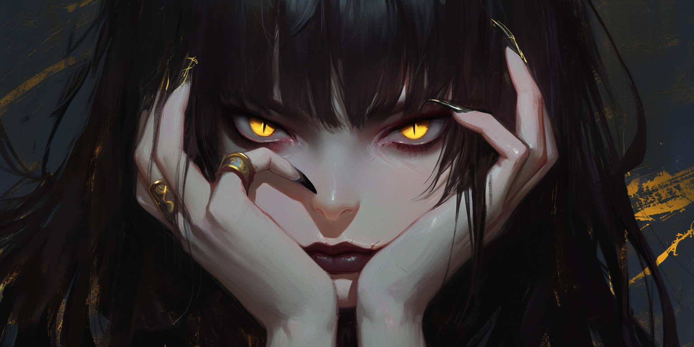
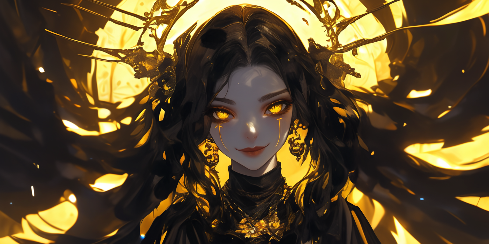

<body>

<h1>💀 MALIGA, THE MUSE OF TRAUMA – Project 9 of The Code Fool's Journey</h1>

<h2>📖 Overview</h2>

<h3>📌Situation</h3>

I've enjoyed writing fiction since high school, and one of the biggest challenges for me and for many other writers is creating a character who truly feels interesting and deep, with clear goals, fears, and inner conflicts. Someone the reader actually wants to follow. When we hit a creative block, it feels like the muses have abandoned us."

<h3>🎯 Task</h3>

My task was to create a simple program to practice generating text files. The program guides the user through a series of questions and answers to create a complete character. In the end, a text file is generated containing the character that was created.

<h3>⚙️ Action</h3>

I created Maliga, the sadistic yet good-humored muse of trauma. She guides the user through this journey using my favorite method for creating characters I know will be objectively interesting, a method based on trauma.

<h3>🧠 Result</h3>

The result was a very simple and fun program, where the user feels like they're creating characters with the muse’s help, not alone. This almost-dialogue helps get the thoughts flowing, and the process moves from simpler questions to the full development of the character’s arc. In just 5 to 10 minutes, the user can create not just a character sheet listing stats, but a sheet that captures the soul of the character, with all the foundations ready for plot and world development. I don’t know if I’ve found the cure for creative block, but I’m sure this will help many character creators.

<h2>🌐 Multi-Language Learning Philosophy</h2>

Just like the first project, this one is being developed in Python, JavaScript, and C++. I’m studying these three languages simultaneously to avoid becoming too attached to the quirks of just one. This method helps me grasp the core logic of programming — which is universal across languages — rather than memorizing syntax. By rewriting the same project in multiple languages, I reinforce my understanding of structures, variables, functions, and flow — while also appreciating the expressive power of each language.

<h2>🧪 Project Scope: The Muse of Traumas</h2>

Core concepts covered (in addition to concepts from previous projects):

<ul>
  <li>File creation</li>
</ul>

<h1>🃏 About the Code Fool's Journey</h1>

The Fool's Journey is similar to Joseph Campbell’s famous Hero’s Journey, but instead of 12 stages, it follows 22 stages, based on the 22 Major Arcana of the Tarot. Each card represents an archetype in the evolution of the protagonist, the Fool, who embarks on a path toward knowledge and personal power, just like programmers and artists. Here, each project increases in complexity and covered concepts, from simple variables and data types to APIs, Memory Management, Databases and GUI.

<h2>📜 Previous Projects</h2>
<ul>
  <li><a href="https://github.com/CaioHerminio/Magecraft">Project 1 - Magecraft University</a></li>
  <li><a href="https://github.com/CaioHerminio/hourglassofdreams">Project 2 - Hourglass of Dreams</a></li>
  <li><a href="https://github.com/CaioHerminio/WelcomeToTheFamily">Project 3 - Welcome to the Family</a></li>
  <li><a href="https://github.com/CaioHerminio/KaijuGenerator">Project 4 - Kaiju Generator</a></li>
  <li><a href="https://github.com/CaioHerminio/GothSummoner">Project 5 - Goth Summoner</a></li>
  <li><a href="https://github.com/CaioHerminio/TarotMachine">Project 6 - Tarot Machine</a></li>
  <li><a href="https://github.com/CaioHerminio/Succonomicon">Project 7 - Succonomicon</a></li>
  </ul>

<h1>✨ Feel Free to Fork the Journey</h1>

If you find this helpful for learning or teaching, you're welcome to fork, improve, or remix it in your own way. The Fool’s path is yours to walk — and code — however you like.😊

</body>
